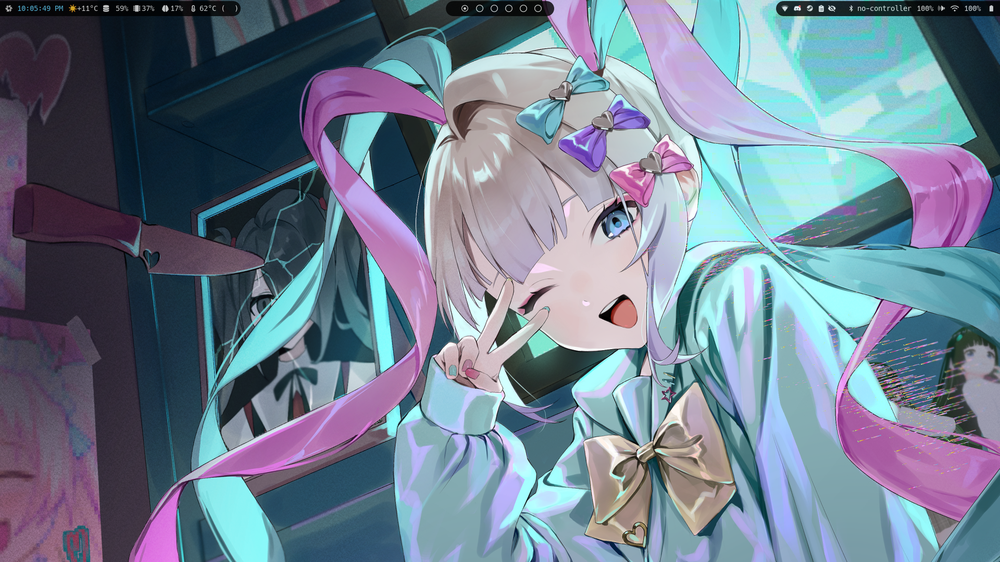
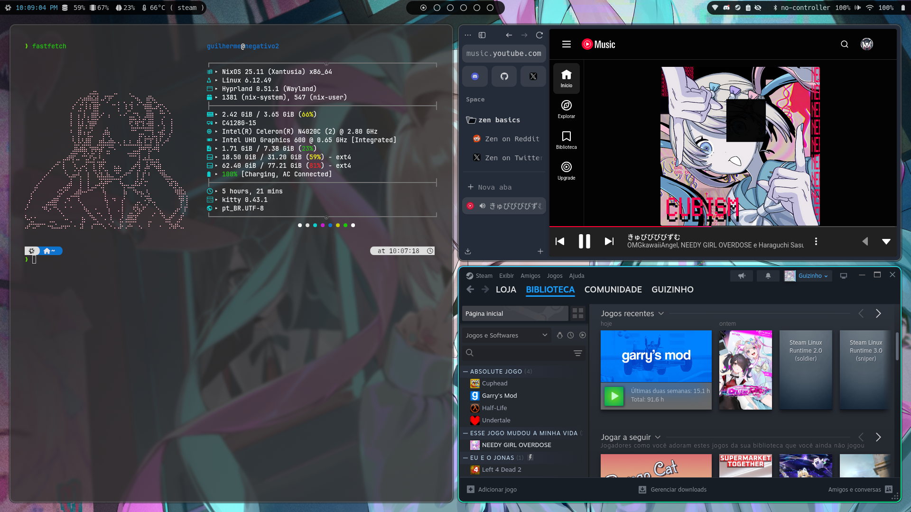

# My **NixOS** Configuration

## I am learning **Nix**, **NixOS** and **Nix** *language*.

I decide preserve my **NixOS** *configuration* and share my *configuration* to others.

## Desktop Images

 

## Configuration

I'm using KDE with ZSH Powerlevel10k, Discord and Steam, Nerd Fonts, nh helper and more configurations.

## Others repository to complement NixOS dotfiles

[My Hyprland Dotfiles](https://gitlab.com/vapor55-group/My-Hyprland-Dotfiles)

## Credits

Thanks to [Deive](https://github.com/HavanaHL) to maked my Flakes.

